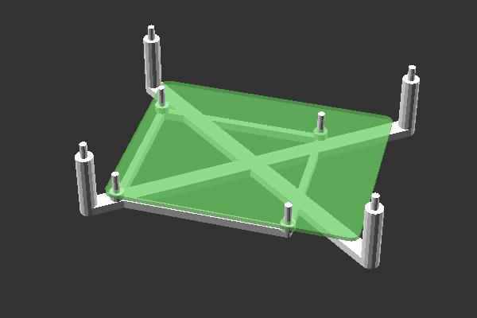
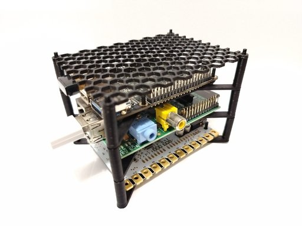

# pi-like-stack

Yet another way to stack pi-like or other SBCs (single board computers) on top of one another.

**For a standard 40pin raspberry pi  A/B or similar board you probably want ``full.stl``**

Also at:

* [printables](https://www.printables.com/model/965132-pi-like-stack/files)
* [thingiverse](https://www.thingiverse.com/thing:6721264/files)





The default board size is for 40-pin like A/B model mainline pi-like devices.
85mm x 56mm x 20mm, with standoffs 2.5mm diameter.

Each layer is 100mm x 75mm.

Printed without-support at 60% infill (PLA)


## Requires

* Openscad (or use the pre-made STLs)

## Quickstart

```
openscad ./pi_like_stack.scad
# Use openscad configurator
# Export as stl

# To build all configured presets as stl:
make
```

## LICENSE

[openscad file & project - MIT](./licenses/pi_like_stack_scad_MIT.txt)

[STL files - CC BY-SA 4.0](./licenses/stls.txt)
